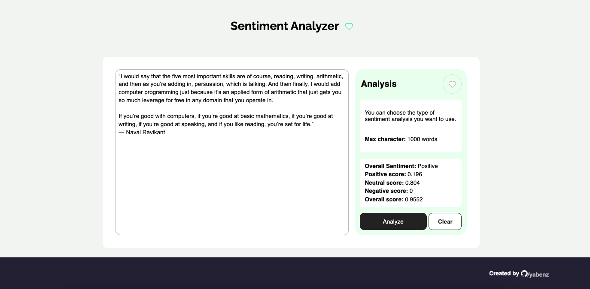

# NLPulse - Sentiment Analyzer Project

Welcome to NLPulse project! This application allows you to analyze the sentiment of any given text using Natural Language Processing (NLP) techniques. The project is built with a **React.js** frontend and a **Python** backend, leveraging the **NLTK** library for sentiment analysis. The backend API is created using **FastAPI**, and the server is powered by **Uvicorn**, an ASGI web server implementation.

The frontend is built with **React** and **TypeScript**, and it uses the **Lucide React** icons library for a sleek and modern user interface. Additionally, you can save your favorite text analyses to your browser's local storage for easy access later.



---

## Features

- **Sentiment Analysis**: Analyze the sentiment of any text input (positive, negative, or neutral).
- **Add to Favorites**: Save your current text analysis to your browser's local storage for quick access later.
- **User-Friendly Interface**: A clean and intuitive UI built with React and TypeScript.
- **FastAPI Backend**: A robust and scalable API for handling sentiment analysis requests.
- **Real-Time Feedback**: The backend server supports hot-reloading for faster development.

---

## Technologies Used

### Frontend
- **React.js**: A JavaScript library for building user interfaces.
- **TypeScript**: A typed superset of JavaScript for better code quality and maintainability.
- **Lucide React**: A lightweight and customizable icon library for React.
- **Local Storage**: Browser-based storage for saving favorite analyses.

### Backend
- **Python**: A powerful programming language for backend development.
- **FastAPI**: A modern, fast (high-performance) web framework for building APIs with Python.
- **NLTK**: A leading platform for building Python programs to work with human language data (sentiment analysis).
- **Uvicorn**: A lightning-fast ASGI server for serving the FastAPI application.

---

## How to Use

### Prerequisites
1. **Node.js** and **npm** installed for running the React frontend.
2. **Python 3.7+** installed for running the FastAPI backend.
3. **NLTK** library installed in your Python environment.

### Installation

#### Frontend
1. Navigate to the `frontend` directory:
   ```bash
   cd frontend
   ```
2. Install the required dependencies:
   ```bash
   npm install
   ```
3. Start the React development server:
   ```bash
   npm start
   ```
   The frontend will be available at `http://localhost:3000`.

#### Backend
1. Ensure you are in the **root folder** of the project (where `main.py` is located).
2. Install the required Python dependencies:
   ```bash
   pip install -r requirements.txt
   ```
3. Download the necessary NLTK data (if not already downloaded):
   ```python
   import nltk
   nltk.download('vader_lexicon')
   ```
4. Activate the virtual environment:
   ```bash
   source .venv/bin/activate
   ```
5. Start the FastAPI server using Uvicorn:
   ```bash
   uvicorn main:app --reload
   ```
   The backend will be available at `http://localhost:8000`.

   **Why `--reload`?**  
   The `--reload` flag enables auto-reloading of the server whenever you make changes to the code. This is especially useful during development, as it saves you from manually restarting the server after every change.

---

## Using the Application

1. Open the React frontend in your browser at `http://localhost:3000`.
2. Paste the text you want to analyze into the input field.
3. Click the "Analyze" button to send the text to the backend for sentiment analysis.
4. The result (positive, negative, or neutral) will be displayed on the screen.
5. Click the "Add to Favorites" button to save the current text analysis to your browser's local storage.
6. View your favorite analyses in the "Favorites" section, where they are stored for quick access.

---

## Project Structure

```
sentiment-analyzer/
├── frontend/                 # React frontend
│   ├── node_modules/         # Frontend dependencies
│   ├── public/               # Static assets
│   ├── src/                  # React components and logic
│   ├── .gitignore            # Frontend-specific ignore rules
│   ├── package-lock.json     # Dependency lock file
│   ├── package.json          # Frontend dependencies and scripts
│   ├── README.md             # Frontend documentation
│   ├── tsconfig.json         # TypeScript configuration
├── .venv/                    # Python virtual environment (if used)
├── __pycache__/              # Python bytecode cache
├── main.py                   # FastAPI application and sentiment analysis logic
├── request.py                # Helper functions for API requests
├── .gitignore                # Root-level ignore rules
├── requirements.txt          # Python dependencies
```

---

## API Endpoints

The backend exposes multiple endpoints for content analysis:

- **GET `/tokenize`**
  - **Description**: Tokenizes the input text into individual words.
  - **Response**:
    ```json
    {
      "tokens": ["word1", "word2", "word3"]
    }
    ```

- **GET `/append/`**
  - **Query Parameter**:
    - `word`: A string to append.
  - **Response**:
    ```json
    {
      "result": "word World"
    }
    ```

- **GET `/sentiment/`**
  - **Query Parameter**:
    - `text`: The input text to analyze.
  - **Response**:
    ```json
    {
      "sentiment": {
        "neg": 0.0,
        "neu": 0.0,
        "pos": 1.0,
        "compound": 0.8,
        "sentiment": "positive"
      }
    }
    ```

---

## Favorites Feature

The "Add to Favorites" feature allows you to save your current text analysis to your browser's local storage. This means your favorite analyses will persist even if you refresh the page or close the browser. You can view and manage your favorites in the "Favorites" section of the application.

---

## Contributing

Contributions are welcome! If you'd like to improve this project, please follow these steps:

1. Fork the repository.
2. Create a new branch for your feature or bugfix.
3. Commit your changes.
4. Push your branch and submit a pull request.

---

## License

This project is open-source and available under the MIT License. Feel free to use, modify, and distribute it as needed.

---

## Acknowledgments

- **NLTK**: For providing an excellent NLP library.
- **FastAPI**: For making API development fast and enjoyable.
- **React**: For enabling the creation of dynamic and responsive user interfaces.
- **Lucide React**: For providing beautiful and customizable icons.

---

Enjoy using the Sentiment Analyzer! If you have any questions or feedback, feel free to reach out. Happy coding! 🚀

---

This updated README now includes the "Add to Favorites" feature, which leverages browser local storage to save and manage favorite text analyses. Let me know if you need further adjustments!
